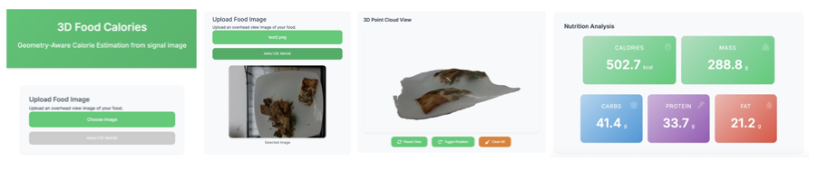

# 3D-FoodCalorie 🍽️📷
**Geometry-Aware Calorie Estimation from a Single Image**

This repository implements a novel three-stage pipeline for estimating nutritional values—such as calorie, mass, fat, carbs, and protein—from a single RGB food image. By integrating semantic segmentation, monocular depth estimation, and RGB-D feature fusion, the system provides geometry-aware calorie predictions that are both scalable and practical for real-world dietary applications.

## 🚀 Pipeline Overview

## 📊 Results
### 1. Semantic Segmentation
- **Backbone**: [Mask R-CNN](https://arxiv.org/abs/1703.06870) (ResNet-50 + FPN)
- **Dataset**: [FoodSeg103](https://xiongweiwu.github.io/foodseg103.html)
- **Purpose**: Isolate food items from the background to provide object-level granularity.

### 2. Self-Supervised Monocular Depth Estimation
- **Architecture**: PWCNet-based optical flow + lightweight DepthNet
- **Supervision**: Scale-aligned triangulation from dense optical flow
- **Datasets**: Pretrained on NYUv2, fine-tuned on [Nutrition5K](https://github.com/google-research-datasets/Nutrition5k)
- **Output**: Food-specific depth maps, even from monocular input

### 3. RGB-D Fusion & Nutrition Estimation
- **Fusion Backbone**: Dual ResNet-101 + Feature Pyramid Network + CBAM + Non-local attention 
- **Purpose**: Predict five types of nutritional values (calories, mass, fat, carbohydrate, protein) from RGB and depth images.
- **Output**: Calories, Mass, Fat, Carbs, Protein

## 💐 Our Contributions
1. Wefine-tunedaMaskR-CNNmodelontheFoodSeg103 dataset to improve food segmentation performance.
2. We propose a novel depth estimation approach by in- tegrating optical flow pathways with depth prediction, trained in a self-supervised manner.
3. Wesystematicallyintegratedsegmentationanddepthes- timation outputs into the nutrition prediction pipeline, enabling fast and accurate inference from a single RGB image.
4. We constructed a new training set using our predicted depth maps and refined segmentation masks on the Nu- trition5k dataset, which significantly improved nutrition estimation in real-world scenarios.
5. We developed a lightweight system demo to support practical use and showcase the full pipeline.
